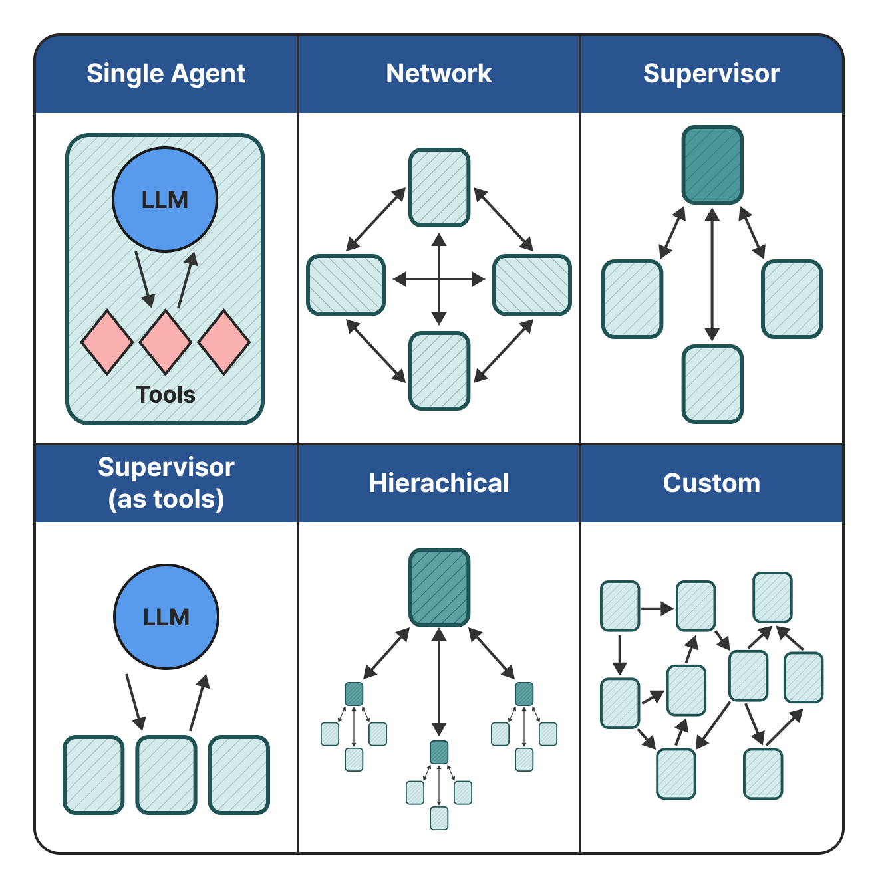
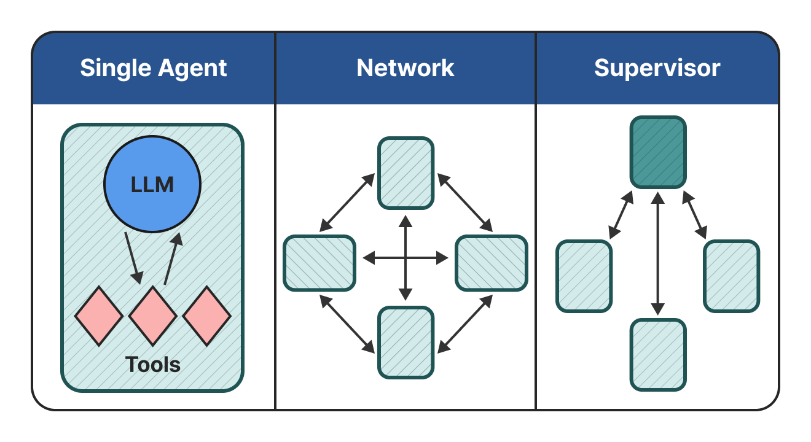
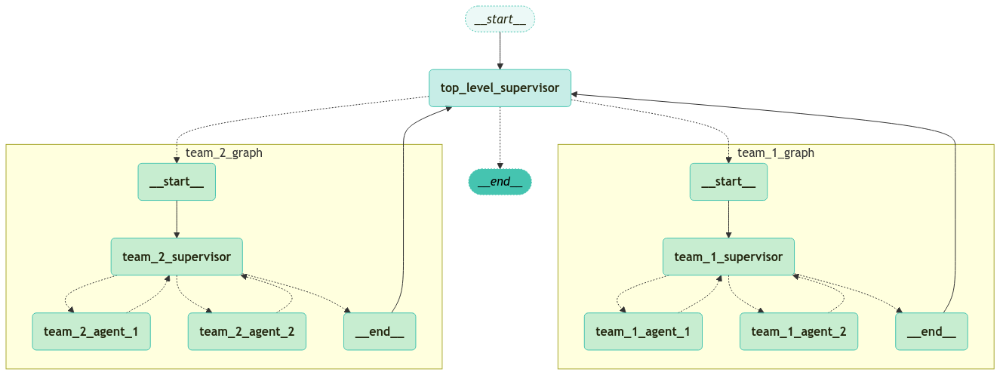
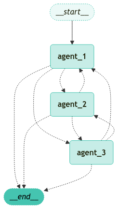
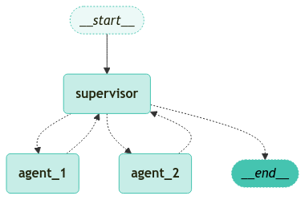

<style>
.custom {
    background-color: #008d8d;
    color: white;
    padding: 0.25em 0.5em 0.25em 0.5em;
    white-space: pre-wrap;       /* css-3 */
    white-space: -moz-pre-wrap;  /* Mozilla, since 1999 */
    white-space: -pre-wrap;      /* Opera 4-6 */
    white-space: -o-pre-wrap;    /* Opera 7 */
    word-wrap: break-word;
}

pre {
    background-color: #027c7c;
    padding-left: 0.5em;
}

</style>

# Multi-Agent Structures (1)

- Author: [Sunyoung Park (architectyou)](https://github.com/architectyou)
- Peer Review:
- Proofread  : [Juni Lee](https://www.linkedin.com/in/ee-juni)
- This is a part of [LangChain Open Tutorial](https://github.com/LangChain-OpenTutorial/LangChain-OpenTutorial)

[](https://colab.research.google.com/github/LangChain-OpenTutorial/LangChain-OpenTutorial/blob/main/17-LangGraph/02-Structures/08-LangGraph-Multi-Agent-Structures-01.ipynb)[](https://github.com/LangChain-OpenTutorial/LangChain-OpenTutorial/blob/main/17-LangGraph/02-Structures/08-LangGraph-Multi-Agent-Structures-01.ipynb)
## Overview

An agent system is a system where LLMs can choose to control the flow of applications. As application systems become increasingly complex over time, managing and handling these systems during development has become more difficult. For example, you may encounter the following problems:

- Agents use too many tools to process, leading to poor quality decisions for subsequent tool calls.
- The context becomes too complex to track a single agent.
- Multiple specialized areas appear to be needed within the system (e.g., planner, researcher, math expert, etc.)

To deal with these situations, you can split your agent service into multiple agents.

Create independent agents and organize them into a **multi-agent** system.

These independent agents each have a single prompt and can make one LLM call or become complex agents like **ReAct Agent**.

The main benefits of using a multi-agent system are:

- **modularity**: easily separate, test, and maintain agents in the agentic system.
- **specialization**: create domain-specific expert agents that improve the performance of the entire system.
- **control**: compared to **Function Calling**, you can clearly see how agents communicate.

There are 6 ways to configure multi-agents.



In this tutorial, we will explore the existing **single agent**, **network**, and **supervisor** structures among these.



### Table of Contents

- [Overview](#overview)
- [Environment Setup](#environment-setup)
- [Single Agent Review](#single-agent-review)
- [Hands-Off](#hands-off)
- [Network Structure](#network-structure)
- [Supervisor Structure](#supervisor-structure)

### References

- [LangGraph: Multi-agent Systems](https://langchain-ai.github.io/langgraph/concepts/multi_agent/)
- [LangGraph: Multi-agent Network](https://langchain-ai.github.io/langgraph/tutorials/multi_agent/multi-agent-collaboration/)
- [LangGraph.Types: Command](https://langchain-ai.github.io/langgraph/reference/types/#langgraph.types.Command)
- [LangGraph: Multi-Agent Communication Between Agents](https://langchain-ai.github.io/langgraph/concepts/multi_agent/#communication-between-agents)
---

## Environment Setup

Set up the environment. You may refer to [Environment Setup](https://wikidocs.net/257836) for more details.

**[Note]**
- ```langchain-opentutorial``` is a package that provides a set of easy-to-use environment setup, useful functions and utilities for tutorials. 
- You can checkout the [```langchain-opentutorial```](https://github.com/LangChain-OpenTutorial/langchain-opentutorial-pypi) for more details.

```python
%%capture --no-stderr
%pip install langchain-opentutorial
```

```python
# Install required packages
from langchain_opentutorial import package

package.install(
    [
        "langgraph",
        "langchain-openai",
    ],
    verbose=False,
    upgrade=False,
)
```

```python
# Set environment variables
from langchain_opentutorial import set_env

set_env(
    {
        "OPENAI_API_KEY": "",
        "LANGCHAIN_API_KEY": "",
        "LANGCHAIN_TRACING_V2": "true",
        "LANGCHAIN_ENDPOINT": "https://api.smith.langchain.com",
        "LANGCHAIN_PROJECT": "Multi-Agent Structures(1)",
    }
)
```

<pre class="custom">Environment variables have been set successfully.
</pre>

You can alternatively set API keys such as ```OPENAI_API_KEY``` in a ```.env``` file and load them.

**[Note]** This is not necessary if you've already set the required API keys in previous steps.

```python
# Load API keys from .env file
from dotenv import load_dotenv

load_dotenv(override=True)
```


<pre class="custom">True</pre>


## Single Agent Review

A **Single Agent** is an agent that has one prompt and makes one LLM call. It operates independently without interacting with other agents. However, as the service you want to build becomes more complex, it becomes difficult to handle complex tasks with just a single prompt and a single LLM call.

Therefore, while **Single Agents** are effective for performing specific tasks in clearly defined environments, they have the limitation of being more restricted compared to Multi-Agent systems in complex and dynamic environments.

Below is an example of a conversational chatbot structured using a single agent that provides simple responses.

```python
from typing import Annotated
from typing_extensions import TypedDict
from langgraph.graph import StateGraph, START, END
from langgraph.graph.message import add_messages


class State(TypedDict):
    # Messages have the type "list". The `add_messages` function
    # in the annotation defines how this state key should be updated
    # (in this case, it appends messages to the list, rather than overwriting them)
    messages: Annotated[list, add_messages]


graph_builder = StateGraph(State)
```

```python
from langchain_openai import ChatOpenAI

llm = ChatOpenAI(model="gpt-4o-mini")


def chatbot(state: State):
    return {"messages": [llm.invoke(state["messages"])]}


# The first argument is the unique node name
# The second argument is the function or object that will be called whenever
# the node is used.
graph_builder.add_node("chatbot", chatbot)
graph_builder.add_edge(START, "chatbot")
graph_builder.add_edge("chatbot", END)
graph = graph_builder.compile()
```

Visualize the Graph.

```python
from langchain_opentutorial.graphs import visualize_graph

visualize_graph(graph)
```


    

    


Run the Single Agent based Chatbot Application.

When entering a query, input it in the next cell in the executor, and enter 'q' when you want to exit.


```python
def stream_graph_updates(user_input: str):
    for event in graph.stream({"messages": [{"role": "user", "content": user_input}]}):
        for value in event.values():
            print("Assistant:", value["messages"][-1].content)


while True:
    try:
        user_input = input("User: ")
        if user_input.lower() in ["quit", "exit", "q"]:
            print("Goodbye!")
            break

        stream_graph_updates(user_input)
    except:
        # fallback if input() is not available
        user_input = "What do you know about LangGraph?"
        print("User: " + user_input)
        stream_graph_updates(user_input)
        break
```

<pre class="custom">Assistant: Certainly! A Multi-Agent System (MAS) is a computational system that consists of multiple interacting agents, which are autonomous entities capable of perceiving their environment, reasoning, and taking actions to achieve specific goals. These agents can be software programs, robots, or any entities that can act and make decisions based on their own objectives and perceptions.
    
    ### Key Features of Multi-Agent Systems:
    
    1. **Autonomy**: Each agent operates independently and can make its own decisions without direct human intervention.
    
    2. **Social Ability**: Agents can communicate and interact with each other, which may involve sharing information, negotiating, or coordinating actions to achieve common goals or resolve conflicts.
    
    3. **Reactivity**: Agents can perceive their environment and respond to changes in it, allowing them to adapt to dynamic situations.
    
    4. **Proactivity**: Agents can take initiative and act in anticipation of future events, rather than just reacting to stimuli.
    
    5. **Heterogeneity**: Agents in a MAS can vary in terms of their capabilities, knowledge, and goals. This diversity allows for more complex and flexible systems.
    
    ### Types of Agents:
    
    - **Reactive Agents**: These agents respond to environmental stimuli but do not have complex internal models of the world.
      
    - **Deliberative Agents**: These agents maintain an internal model of the world and plan their actions based on this model.
    
    - **Hybrid Agents**: These combine both reactive and deliberative capabilities.
    
    ### Applications of Multi-Agent Systems:
    
    - **Robotics**: In swarm robotics, multiple robots work together to complete tasks such as exploration, mapping, or search and rescue.
    
    - **Distributed Control Systems**: MAS can be used to manage and control systems in manufacturing, transportation, and logistics.
    
    - **Game AI**: Agents can simulate complex behaviors in video games or simulations, providing realistic interactions.
    
    - **E-commerce**: Agents can negotiate and trade on behalf of users, optimizing the purchasing process.
    
    - **Smart Environments**: In smart homes or cities, agents can interact to manage resources efficiently, such as energy consumption and traffic flow.
    
    ### Benefits of Multi-Agent Systems:
    
    - **Scalability**: They can handle large and complex problems by distributing tasks among multiple agents.
    
    - **Robustness**: The failure of a single agent does not necessarily compromise the entire system, as other agents can continue to operate.
    
    - **Flexibility**: MAS can adapt to changing environments and requirements more easily than centralized systems.
    
    ### Challenges:
    
    - **Coordination**: Ensuring that agents work together effectively can be challenging, particularly when their goals conflict.
    
    - **Communication**: Developing efficient communication protocols for agents to share information and negotiate can be complex.
    
    - **Security**: Ensuring that the interactions among agents are secure and that malicious agents do not disrupt the system is crucial.
    
    In summary, Multi-Agent Systems provide a powerful framework for building complex systems that require decentralized control, collaboration, and adaptability. They are widely used in various fields, from robotics to economics, and continue to be an area of active research and development.
    Goodbye!
</pre>

## Hands-Off

In a multi-agent architecture, agents can be represented as graph nodes. Each agent node executes a step and decides whether to complete execution or route to another agent. This potentially includes routing to itself (i.e., running in a loop). 

A common pattern in multi-agent interactions is a handoff, where one agent passes control to another agent. With handoffs, you can specify:

- **Destination**: The target agent to navigate to (e.g., the name of the node to move to)
- **Payload**: Information to pass to that agent (e.g., ```state``` updates)

To implement handoffs in LangGraph, agent nodes can return a ```Command``` object that combines control flow and state updates.

```python
from typing import Literal
from langgraph.types import Command

def agent(state) -> Command[Literal["agent", "another_agent"]]:
    # the condition for routing/halting can be anything, e.g. LLM tool call / structured output, etc.
    goto = get_next_agent(...)  # 'agent' / 'another_agent'
    return Command(
        # Specify which agent to call next
        goto=goto,
        # Update the graph state
        update={"my_state_key": "my_state_value"}
    )
```

In more complex scenarios where each agent node itself is a graph (i.e., a subgraph), a node in one of the agent subgraphs might want to move to another agent. For example, if you have two agents, alice and bob (subgraph nodes in the parent graph), and you need to move from bob to alice, you can set ```graph=Command.PARENT``` in the ```Command``` object.

```python
def some_node_inside_alice(state):
    return Command(
        goto="bob",
        update={"my_state_key": "my_state_value"},
        # specify which graph to navigate to (defaults to the current graph)
        graph=Command.PARENT,
    )
```

[NOTE]

If you need to support visualization for subgraphs communicating using Command(graph=Command.PARENT) you would need to wrap them in a node function with Command annotation, e.g. instead of this:

```python
builder.add_node(alice)
```
you would need to do this:

```python
def call_alice(state) -> Command[Literal["bob"]]:
    return alice.invoke(state)

builder.add_node("alice", call_alice)
```

### Handoffs as Tools

One of the most common types of agents is the **ReAct-style tool-calling** agent. For this type of agent, a common pattern is to wrap handoffs as tool calls.

For example:

```python
def transfer_to_bob(state):
    """Transfer to bob."""
    return Command(
        goto="bob",
        update={"my_state_key": "my_state_value"},
        graph=Command.PARENT,
    )
```

This is a special case of updating graph state from a tool, which includes control flow in addition to ```state``` updates.

## Network Structure

In this architecture, agents are defined as **graph nodes**. Each agent can communicate with all other agents (**many-to-many connections**) and can decide which agent to call next. This architecture is suitable for problems where there is no clear hierarchy of agents or specific order in which agents must be called.

```python
from langgraph.graph import MessagesState

model = ChatOpenAI(
    model="gpt-4o-mini",
)

def agent_1(state: MessagesState) -> Command[Literal["agent_2", "agent_3", END]]:
    # you can pass relevant parts of the state to the LLM (e.g., state["messages"])
    # to determine which agent to call next. a common pattern is to call the model
    # with a structured output (e.g. force it to return an output with a "next_agent" field)
    response = model.invoke(...)
    # route to one of the agents or exit based on the LLM's decision
    # if the LLM returns "__end__", the graph will finish execution
    return Command(
        goto=response["next_agent"],
        update={"messages": [response["content"]]},
    )

def agent_2(state: MessagesState) -> Command[Literal["agent_1", "agent_3", END]]:
    response = model.invoke(...)
    return Command(
        goto=response["next_agent"],
        update={"messages": [response["content"]]},
    )

def agent_3(state: MessagesState) -> Command[Literal["agent_1", "agent_2", END]]:
    ...
    return Command(
        goto=response["next_agent"],
        update={"messages": [response["content"]]},
    )

builder = StateGraph(MessagesState)
builder.add_node(agent_1)
builder.add_node(agent_2)
builder.add_node(agent_3)

builder.add_edge(START, "agent_1")
network = builder.compile()
```

Visualize the Network.

```python
visualize_graph(network)
```


    

    


## Supervisor Structure

In this architecture, we define agents as nodes and add a supervisor node (LLM) that decides which agent node to call next. We use ```Command``` to route execution to the appropriate agent node based on the supervisor's decision. This architecture is also suitable for running multiple agents in parallel or using map-reduce patterns.

```python
model = ChatOpenAI(
    model="gpt-4o-mini",
)

def supervisor(state: MessagesState) -> Command[Literal["agent_1", "agent_2", END]]:
    # you can pass relevant parts of the state to the LLM (e.g., state["messages"])
    # to determine which agent to call next. a common pattern is to call the model
    # with a structured output (e.g. force it to return an output with a "next_agent" field)
    response = model.invoke(...)
    # route to one of the agents or exit based on the supervisor's decision
    # if the supervisor returns "__end__", the graph will finish execution
    return Command(goto=response["next_agent"])

def agent_1(state: MessagesState) -> Command[Literal["supervisor"]]:
    # you can pass relevant parts of the state to the LLM (e.g., state["messages"])
    # and add any additional logic (different models, custom prompts, structured output, etc.)
    response = model.invoke(...)
    return Command(
        goto="supervisor",
        update={"messages": [response]},
    )

def agent_2(state: MessagesState) -> Command[Literal["supervisor"]]:
    response = model.invoke(...)
    return Command(
        goto="supervisor",
        update={"messages": [response]},
    )

builder = StateGraph(MessagesState)
builder.add_node(supervisor)
builder.add_node(agent_1)
builder.add_node(agent_2)

builder.add_edge(START, "supervisor")

supervisor = builder.compile()
```

Visualize the Network.

```python
visualize_graph(supervisor)
```


    

    

